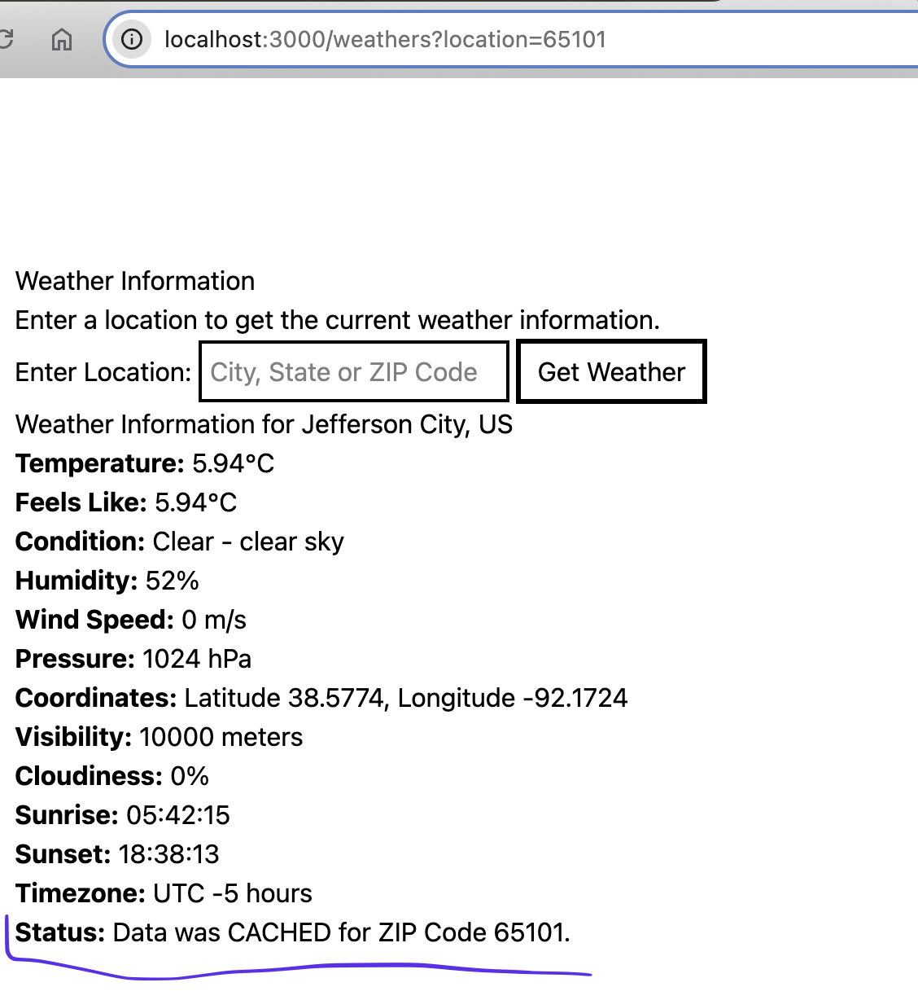

# WeatherApp

WeatherApp is a simple Ruby on Rails application that provides weather information for a given location. It uses data from OpenWeatherMap and geolocation services from the Geocoder gem. The application caches weather data for each Zip Code for 30 minutes to improve performance and reduce API calls.

---

## Features

- Fetches **current weather information** from [OpenWeatherMap](https://openweathermap.org/).
- Uses **Geocoder gem** to convert city and state into geographic coordinates.
- Uses **ZipCodes gem** to search by US Zip codes, Because 5 digit Zip codes are not Globally unique.
- Caches weather data for **30 minutes** per BY ZipCode to optimize API usage. 
- Displays weather details such as temperature, humidity, wind speed, and more.
- Encrypts API in repo for security
- Weather fetching is encapsulated in a Databaseless Model to keep Controller DRY
- Model and Requests are tested using Rspec

---

## Setup Instructions

1. Clone the repository:
   ```bash
   git clone git@github.com:riniculous/WeatherApp.git
   cd WeatherApp
   ```

2. Install dependencies:
   ```bash
   bin/setup
   ```

3. Install Gems
  ```bundle install```

4. Copy master.key (was emailed) file to /config

5. Start the development server:
   ```bash
   bin/dev
   ```

6. Run tests:
   ```bash
   bundle exec rspec
   ```

---

## API Keys

The application uses an API key for OpenWeatherMap, which is securely encrypted stored using Rails credentials. Attached in the email is my master.key for this project. Copy master.key file to /config directory

OR you can setup your OWN api key which you can obtain from OpenWeatherMap And added to the App with:
```RAILS_ENV=development EDITOR="nano" rails credentials:edit```
set variable named  `weather_api`

---

## Caching

Weather data is cached for **30 minutes** per Zipcode using Rails' built-in caching mechanism. This reduces the number of API calls and improves performance. Uses ZipCodes gem to search by US Zip codes only, Because 5 digit Zip codes are not Globally unique. Searching by City and State sets cache for first zipcode returned for that city, NOT all Zipcodes for that city.



---

## Dependencies

- **Ruby on Rails**: The web framework used to build the application. 
- **Ruby on Rails**: The web framework used to build the application. 
- **Geocoder Gem**: Converts city and state into geographic coordinates.
- **ZipCode Gem**: Converts city and state into geographic coordinates.
- **OpenWeatherMap API**: Provides weather data.

---

## Running Tests

To ensure everything is working correctly, run the test suite:

```bash
bundle exec rspec
```

This will execute all the tests for the application.

---

## License

This project is licensed under the MIT License. See the LICENSE file for details.

* ...
